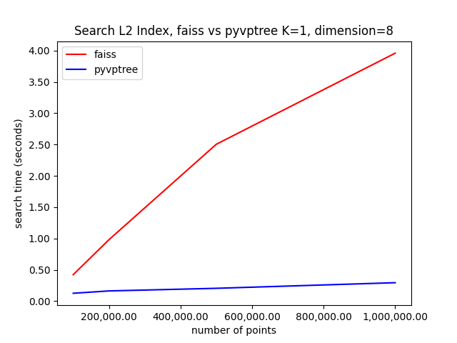
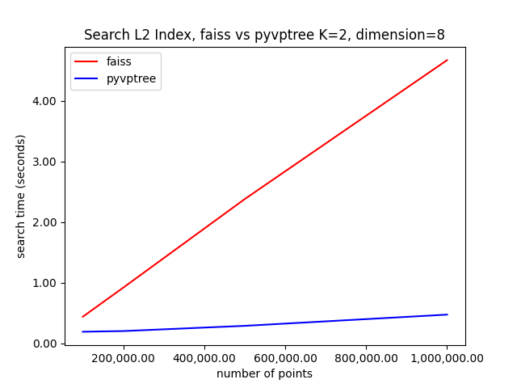
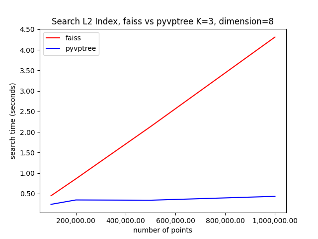
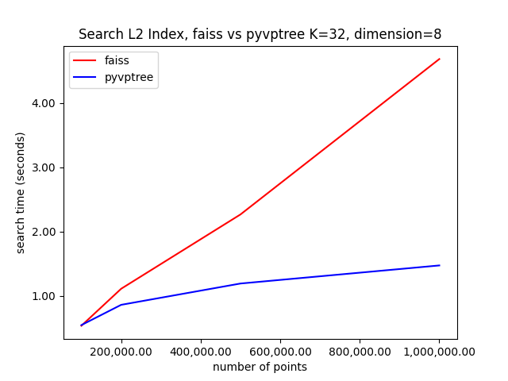
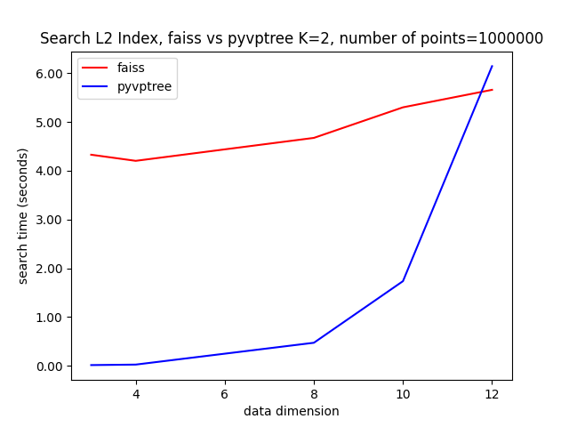

# Introduction

pyvptree is a python library, internally built in C++, for efficient KNN search using L2 distance (for points in multidimensional space using VPTreeL2Index), or Hamming distances (for binary features represented by uint8 type, using VPTreeBinaryIndex). 

# How this library works

This library implements a [Vantage Point Tree](https://en.wikipedia.org/wiki/Vantage-point_tree) to perform search within multidimensional metric spaces using arbitrary distance functions.

Vantage Point Trees allow for more efficient search since they avoid the Curse of Dimensionality problem and work as a binary tree partition of the search space.
 
This library still provides no feature compresion strategy (yet), and only sypport raw (uncompressed) feature search.

# Installation

```console
python setup.py install
```

Performance can dramatically decrase if this library is compiled without support to Open MP and AVX. This library was not tested under windows.

# Requeriments

This library needs OpenMP support to be built and installed. The whole compilation procces occur automatically by performing the installation step above.

# Benchmarks - Faiss comparison

pyvptree shows really good results for dimensions up to 16 using L2 Index (e.g: euclidean distance function), but shows poor reults for higher dimensions. This happens because in higher dimensions, all points tend to have similar distances from any reference point. This is due to the nature of the L2 distance (and most distance functions in high dimensions): when number of coordinates increase, the number of terms in the sum within the distance function increases, and each coordinate has less contribution. In result, a point has to be radically different in one or many coordinates to make a big difference in the distance relative value (this is known as Curse of Dimensionality). Since all points have similar distance from a vantage point, it becomes hard to properly divide the set of points in a meaningful way: all points tend be to located close to the partition boundary (which is very small), thus making necessary to always search into neighbor partitions, resulting in a nearly linear exaustive search in higher dimensions. Faiss, in the other hand, uses kmeans and kd-trees, which although suffers from the same problem in higher dimensions, show better behavior up to higher dimensions when compared to the vantage point trees. Another aspect to consider is distance function optimization: faiss has really good optimizations for taking advantage of processor pipeline, caching, to prevent branching and to make good use of parallelism. The implementation of this module in C++ also make use of openmp and processor pipeline optimization, but not as deep as faiss library.

For binary index, faiss is much superior because binary data is quite always high dimensional (e.g: image descriptors are tipically 32 or 64-dimensional) and faiss is also specially optimized for binary data with a highly optimized implementation of the hamming distance function. It is very hard to beat faiss when comes to binary indices.

For conclusion, as the graphs below can show, pyvptree can beat faiss for L2 indices up to about 14-dimensional data.

Its also important to say that faiss has dozens of advanced features such as many compression techniques and different types of indices and development support, which this library does not intent to provide fully for now.

Below there are some comparisons between pyvptree and faiss.

All benchmarks were run in a Intel(R) Core(TM) i7-4870HQ CPU @ 2.50GHz (Haswell - 4th Generation Intel Core) CPU, running macOS 12.0.1.
Python version used is 3.9.8.

In the below graphs, K is the number of neighbors used in the search.

## Benchmark - pyvptree.VPTreeL2Index vs faiss.IndexFlatL2








## Benchmark - pyvptree.VPTreeBinaryIndex vs faiss.IndexBinaryFlat

Work in progress...

# Usage

## Searching L2 Features

```python

import pyvptree
import numpy as np

np.random.seed(seed=42)

data = np.random.rand(num_features, dimension)

num_points = 400000 # can be arbitrary feature size, as long fits your memory
dimension = 3 # can be arbitrary dimension size
data = np.random.rand(num_points, dimension)

num_queries = 2000
queries = np.random.rand(num_queries, dimension)

K = 4 # search 4 nearest neighbors

vptree = pyvptree.VPTreeL2Index()
vptree.set(data)
vptree_indices, vptree_distances = vptree.searchKNN(queries, K)

```

## Searching Binary Features

```python

import pyvptree
import numpy as np

 np.random.seed(seed=42)

dimension = 32 # 32 bytes = 256 bit examples
num_points = 2021
data = np.random.normal(scale=255, loc=0, size=(num_points, dimension)).astype(dtype=np.uint8)

num_queries = 8
queries = np.random.normal(scale=255, loc=0, size=(num_queries, dimension)).astype(dtype=np.uint8)

K = 2  # search 2 nearest neighbors

vptree = pyvptree.VPTreeBinaryIndex()
vptree.set(data)
vptree_indices, vptree_distances = vptree.searchKNN(queries, K)

```

# Searching for the nearest neighbor (K=1)

There is an optimized version of KNN for K=1:

```python

vptree = pyvptree.VPTreeBinaryIndex()
vptree.set(data)
vptree_indices, vptree_distances = vptree.search1NN(queries)

```

Which is considerably faster than calling the generic searchKNN with K=1. This option is available for both L2 and Binary indices.


# Using the C++ library
You can install vptree C++ library header using cmake. The library is a single header only.

To install, run:

```console
mkdir build
cd build

cmake ..
make
make install
```

# Development

The C++ code is a one header file within include/VPTree.hpp.

To use the project with some compiling tools on can use CMake to export the compile commands (optional):

```console
mkdir build
cd build

cmake -DCMAKE_EXPORT_COMPILE_COMMANDS=1 ../

make install
```

To run C++ tests, run the below command, after running cmake:

```console
make test
```

For running python tests:

```console
python3 -m pytest
```


# TODO

- Index serialization / deserialization
- Index split into multiple machines remotely to search faster
- Improve binary index using bach calculation and AVX2
- Create specialized data containers for each feature size (32, 64, etc..) instead of always using bytes, to improve hamming distance calculations.

