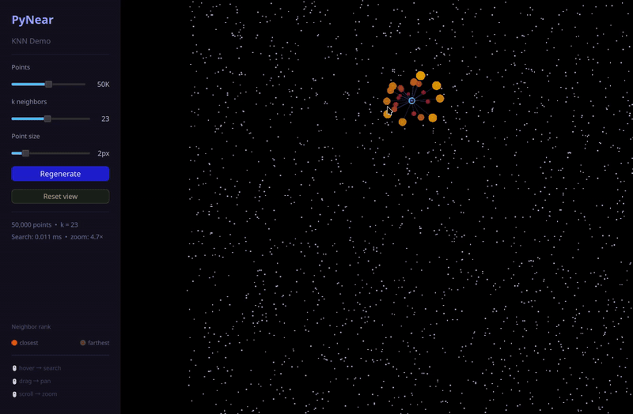
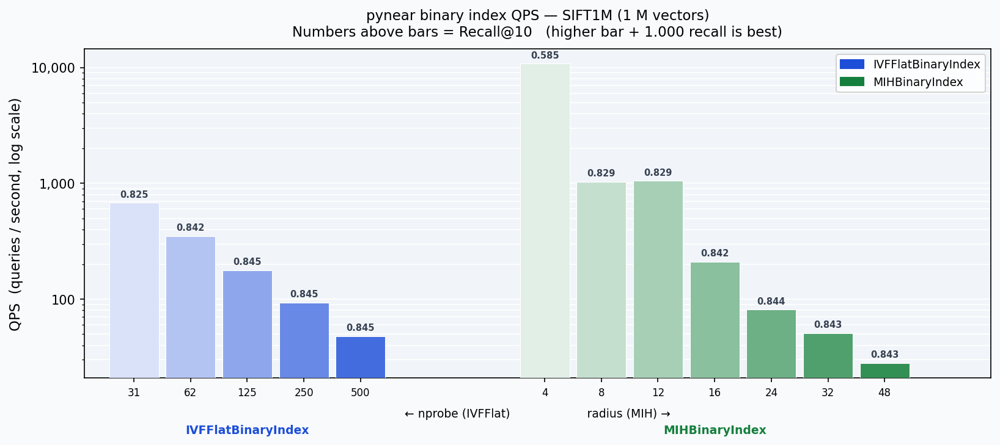

# PyNear

[](https://pypi.org/project/pynear/)
[](https://pypi.org/project/pynear/)
[](https://github.com/pablocael/pynear/actions/workflows/pythonpackage.yml)
[](LICENSE)
[](https://github.com/pablocael/pynear/stargazers)

> **k-NN with guarantees.** Near-duplicate search that provably misses nothing,
> quantised ANN that beats float indexes at 4× less RAM, and exact search when
> exactness is mandatory.
>
> **MIH** — binary near-duplicate retrieval with a pigeonhole *completeness
> guarantee* (every neighbour within your radius is found), up to 3.5× faster
> than Faiss's MIH at matched recall · **SQ8 HNSW** — tracks or beats Faiss's
> *float* HNSW up to ~0.91 recall at a quarter of the memory · **VP-trees** —
> exact k-NN 12× faster than a flat scan for CV matching, dedup compliance,
> and ANN ground truth · drop-in for scikit-learn · SIMD on x86 and ARM ·
> zero native deps beyond NumPy.



**PyNear** is a metric-space nearest-neighbour library with a C++ core, built for the workloads *between* the embeddings world and brute force: **binary descriptors with recall guarantees** (MIH + IVF-Binary + the novel MIH-seeded HNSW — dedup, copy detection, ORB/BRIEF matching, robotics), **memory-tight ANN** (HNSW with int8 quantisation), and **exact search** (VP-trees, up to ~256-D) where a missed neighbour is a bug, not a recall statistic. One small NumPy-only API, scikit-learn drop-in, pre-built wheels (`pip install pynear`). For high-dimensional embedding retrieval at high recall, Faiss's HNSW is ~1.5× faster than ours — [we publish that number ourselves](#pynear-vs-faiss-in-numbers), along with every other one where Faiss wins.

---

## Table of Contents

- [Introduction](#introduction)
- [Why PyNear?](#why-pynear)
- [Choosing an index](#choosing-an-index)
- [Installation](#installation)
- [Quick start](#quick-start)
  - [Low-dimensional exact search (VPTreeL2Index)](#low-dimensional-exact-search-vptreel2index)
  - [High-dimensional binary descriptors (MIHBinaryIndex)](#high-dimensional-binary-descriptors-mihbinaryindex)
- [Migrating from scikit-learn](#migrating-from-scikit-learn)
- [Features](#features)
  - [Available indices](#available-indices)
  - [Pickle serialisation](#pickle-serialisation)
  - [Tree inspection](#tree-inspection)
- [Demos](#demos)
- [Benchmarks](#benchmarks)
- [Real-World Benchmark — SIFT1M Binary](#real-world-benchmark--sift1m-binary)
- [Development](#development)

---

## Introduction

Search, recommendation, deduplication, and retrieval-augmented generation all
reduce to the same primitive: turn an item — an image, an audio clip, a
document, a face — into a **descriptor** (a fixed-length vector or bit-string),
then find the descriptors nearest to it. Similar items map to nearby points, so
*"find similar"* becomes *"find nearest neighbours."*

The right way to search depends on the data, and PyNear gives you one API for
all three regimes instead of forcing every problem through the same tool:

- **Low-to-mid dimensions (a few up to ~256-D)** — exact tree search wins. A
  **VP-Tree** prunes by distance to vantage points and returns the *true*
  nearest neighbours, no recall loss, no tuning — [12–13× faster than
  Faiss's brute-force scan](#pynear-vs-faiss-in-numbers) on the same data.
- **High-dimensional float vectors (512–1024-D embeddings)** — exact pruning
  collapses (the *curse of dimensionality*), so **IVF-Flat** trades a sliver of
  recall for large speed-ups.
- **Binary descriptors (ORB, BRIEF, perceptual hashes, SimHash)** — Hamming
  distance plus **Multi-Index Hashing** uses the pigeonhole principle to find
  near-duplicates without scanning the whole dataset.

**What people build with it:**

- **Image / video deduplication & copy detection** — perceptual-hash / ORB
  descriptors + `MIHBinaryIndex`.
- **Audio fingerprinting** (Shazam-style) — spectrogram-peak descriptors +
  Hamming search.
- **Semantic & RAG retrieval** — text/image embeddings + `IVFFlatCosineIndex`.
- **Classic ML** — drop-in `KNeighborsClassifier` / `Regressor` backed by
  VP-Trees.

> New to nearest-neighbour search? See [docs/intro.md](./docs/intro.md) for a
> gentle, jargon-free introduction — or the deep dive,
> [*The shared recipe behind image search, Shazam, and RAG*](https://medium.com/@pablo.cael/the-shared-recipe-behind-search-images-shazam-and-rag-08fc93a276ac).

---

## Why PyNear?

| | PyNear | Faiss | Annoy | scikit-learn |
|---|---|---|---|---|
| **Metric agnostic** | ✅ L2, L1, L∞, cosine, Hamming | L2 / IP / cosine | L2 / cosine / Hamming | L2 / others |
| **HNSW (incl. binary)** | ✅ + novel MIH-seeded variant for binary | ✅ | ❌ | ❌ |
| **Binary / Hamming with recall guarantee** | ✅ MIH pigeonhole guarantee at index speed; up to 3.5× Faiss's MIH at matched recall, ~2,500× at 512-bit | ✅ MIH (collapses at wide codes) + IVF | ❌ | ❌ |
| **scikit-learn drop-in** | ✅ adapter classes | ❌ | ❌ | — |
| **Zero native deps** | ✅ NumPy only | ❌ compiled lib + optional GPU | ❌ | ❌ |

[Full comparison →](./docs/comparison.md)

### PyNear vs Faiss, in numbers

All measured July 2026 on a 24-core machine, **index vs index, with Faiss
running in its own process** so the numbers are fair (two OpenMP runtimes in
one process throttle Faiss — see the methodology note below). Reproducible via
`demo_faiss_comparison.py` and the [benchmark suite](./pynear/benchmark/).

**Index vs index — where PyNear wins:**

| Workload | PyNear | Faiss | Verdict |
|---|---|---|---|
| **SIFT1M 128-bit**, MIH vs MIH at matched recall | `MIHBinaryIndex` | `IndexBinaryMultiHash` | **PyNear up to 3.5× faster** across the recall curve |
| **512-bit near-duplicates**, 1M codes, 100% Recall@10 | `MIHBinaryIndex` **114,039 QPS** | `IndexBinaryMultiHash` 46 QPS | **PyNear ~2,500× faster** — Faiss's MIH is not viable at this width |
| **Quantised vs float ANN**: SQ8 HNSW vs Faiss's float HNSW, 100k × 128-D | `HNSWL2IndexSQ8` **291k QPS @ 0.91 recall** | `IndexHNSWFlat` ~260k QPS | **PyNear tracks or beats it up to ~0.91 recall at 4× less vector memory** |
| **Guaranteed-complete near-duplicate retrieval** (every neighbour within the radius, by pigeonhole) | `MIHBinaryIndex` **114,039 QPS** | exact scan is the only alternative with the same guarantee: 3,341 QPS | **PyNear 34× faster at 100% recall** |
| **IVF build time**, 50k float vectors, 128–1024-D | **0.37–1.5 s** | 0.51–3.7 s | **PyNear 1.4–2.4× faster builds** |
| **Exactness required** (CV feature matching, dedup compliance, ANN ground truth), ≤256-D | `VPTreeL2Index` **0.49–0.86 ms**/batch | `IndexFlatL2` (Faiss's only exact option) 5.7–11.4 ms | **PyNear 12–13×** — a pruning tree vs a scan |

**Index vs index — where Faiss wins (kept on purpose):**

| Workload | PyNear | Faiss | Verdict |
|---|---|---|---|
| **Float HNSW**, matched recall | `HNSWL2Index` 131k QPS @ 0.96 | `IndexHNSWFlat` **203k QPS @ 0.97** | **Faiss ~1.5× faster** (recall-per-ef identical — graph quality is at parity) |
| **Quantised HNSW**, like for like | `HNSWL2IndexSQ8` (ceiling 0.940) | `IndexHNSWSQ` **(ceiling 0.944)** | **Faiss ~1.5–1.8× faster** at matched recall |
| Approximate **float** L2 raw latency, 128–1024-D | `IVFFlatL2Index` 5.6–21.5 ms | `IndexIVFFlat` **0.2–2.8 ms** | **Faiss wins 8–32×** (BLAS inner scan) |
| Exact **binary** k-NN | `VPTreeBinaryIndex` 3.2–15.9 ms | `IndexBinaryFlat` **0.15–0.29 ms** | **Faiss wins at every width** — use PyNear's MIH/IVF for binary instead |

If your workload is high-dimensional embedding retrieval, Faiss's HNSW/IVF
are faster and we say so with numbers — the
[full PDF report](./docs/benchmarks.pdf) keeps every losing figure. PyNear's
case is the workloads *between* the embeddings world and brute force:
**binary descriptors with completeness guarantees** (dedup, copy detection,
ORB/BRIEF matching), **memory-tight ANN** (SQ8 ahead of Faiss's float index
below ~0.91 recall at a quarter of the RAM), **exactness where it's
mandatory** (CV matching, compliance, ground-truth generation), zero native
dependencies, and a one-line `pip install`.

> **Methodology note:** PyNear links libgomp and `faiss-cpu` links libomp.
> Loaded into one process, the two OpenMP runtimes contend and Faiss's flat
> scans degrade dramatically (~78× on binary popcount scans here). Benchmarks
> that compare the two libraries in a single process — including some of our
> own older numbers — flatter PyNear. All Faiss figures above were measured
> in a Faiss-only subprocess.

---

## Choosing an index

| Your situation | Use |
|---|---|
| **Text / image embeddings** (cosine, 384-1024 D, want fast queries) | `HNSWCosineIndex` |
| Same but **memory-tight** (millions of vectors on one box) | `HNSWL2IndexSQ8` — 4× less RAM, ~1-3% recall hit |
| **Generic float L2 ANN** | `HNSWL2Index` |
| **Exact answers** required (small / moderate D ≤ 256) | `VPTreeL2Index` (or `L1`, `Chebyshev`, `Cosine`) |
| **Binary descriptors** (perceptual hash, ORB, BRIEF, SimHash) — near-duplicate detection | `MIHBinaryIndex` (pigeonhole guarantee: every neighbour within your radius is found; 34× faster than the exact scan, which is the only alternative with the same guarantee) |
| Binary + want graph fallback for larger queries | `MIHSeededHNSWBinaryIndex` (novel — MIH seeds the HNSW beam search) |
| **Range / threshold queries** on binary descriptors | `BKTreeBinaryIndex` |
| Already on `sklearn.neighbors.*` | `pynear.sklearn_adapter.PyNearKNeighborsClassifier` etc. — drop-in |
| Building from scratch and want the closest match to "what hnswlib does" | `HNSWL2Index(M=16, ef_construction=200, ef_search=50)` |

When in doubt: **`HNSWCosineIndex` for embeddings, `MIHBinaryIndex` for binary, `VPTreeL2Index` for exact**.

> 📖 **For HNSW specifically** — including the `add()` / `remove()` /
> `rebuild()` mutation API, filtered search, parameter tuning, and a
> per-variant decision guide — see [**`docs/hnsw.md`**](./docs/hnsw.md).

---

## Installation

```console
pip install pynear
```

Requires Python 3.8+ and NumPy ≥ 1.21.2.  Pre-built wheels are available for
Linux, macOS (x86-64 and Apple Silicon), and Windows — no compiler needed.

### CPU baseline and build tuning

Pre-built x86-64 wheels target **AVX2** (plus FMA and POPCNT) — any Intel or
AMD CPU from 2013 (Haswell) onwards. AVX-512 is never included in wheels, so
they run identically on every AVX2-capable machine. ARM wheels use NEON,
which is part of the base ISA.

When building from source, the `PYNEAR_MARCH` environment variable replaces
the AVX2 baseline with an arbitrary `-march=` target:

```console
# Maximum performance on this machine — enables AVX-512 where present
PYNEAR_MARCH=native pip install --no-binary :all: pynear

# Portable build for pre-2013 CPUs without AVX2
PYNEAR_MARCH=x86-64 pip install --no-binary :all: pynear
```

To force the scalar (non-SIMD) kernels, e.g. as a benchmarking baseline:

```console
CFLAGS=-DPYNEAR_FORCE_SCALAR pip install --no-binary :all: pynear
```

---

## Quick start

PyNear's two headline indices: exact **VP-Trees** for low-to-mid dimensions,
and **Multi-Index Hashing** for binary descriptors.

### Low-dimensional exact search (VPTreeL2Index)

VP-Trees partition points by *distance to a vantage point*, so they prune whole
branches in any metric space and return **exact** neighbours — no recall loss,
no tuning — and stay effective up to ~256-D. The same API backs L2, L1, L∞,
cosine, and Hamming.

```python
import numpy as np
import pynear

# 100,000 vectors in 32-D
data = np.random.rand(100_000, 32).astype(np.float32)
index = pynear.VPTreeL2Index()
index.set(data)

# KNN search — returns (indices, distances) per query, sorted nearest-first
queries = np.random.rand(10, 32).astype(np.float32)
indices, distances = index.searchKNN(queries, k=5)

# 1-NN shortcut (slightly faster than searchKNN with k=1)
nn_indices, nn_distances = index.search1NN(queries)
```

### High-dimensional binary descriptors (MIHBinaryIndex)

`MIHBinaryIndex` is pynear's flagship for **binary** descriptors (ORB, BRIEF,
AKAZE, perceptual hashes, SimHash). Multi-Index Hashing splits each *d*-bit
descriptor into `m` sub-strings and hashes them; by the **pigeonhole
principle**, any neighbour within `radius` Hamming bits is *guaranteed* to be
found. On wide descriptors it retrieves near-duplicates **~34× faster than
Faiss's brute-force scan** at 100% recall — and faster than Faiss's own MIH.

```python
import numpy as np
import pynear

# 1M × 512-bit descriptors (64 bytes each)
db      = np.random.randint(0, 256, size=(1_000_000, 64), dtype=np.uint8)
queries = np.random.randint(0, 256, size=(100, 64), dtype=np.uint8)

mih = pynear.MIHBinaryIndex(m=8)   # 8 sub-tables of 64 bits (m=4 for 128/256-bit)
mih.set(db)
indices, distances = mih.searchKNN(queries, k=10, radius=8)
# radius: any true neighbour within this Hamming distance is guaranteed found
# (pigeonhole). Increase for higher recall on noisier data.
```

When you'd rather cap the cost per query than reason about a radius,
`IVFFlatBinaryIndex` scans a fixed number of clusters instead:

```python
ivf = pynear.IVFFlatBinaryIndex(nlist=512, nprobe=16)
ivf.set(db)
indices, distances = ivf.searchKNN(queries, k=10)
ivf.set_nprobe(32)   # trade speed for recall at runtime
```

**Choosing between MIH and IVFFlat:**

| | `MIHBinaryIndex` | `IVFFlatBinaryIndex` |
|---|---|---|
| Best for | Near-duplicate retrieval (small Hamming radius) | General approximate Hamming KNN |
| d=512, N=1M query time (near-duplicate) | **0.009 ms** | 0.021 ms |
| Recall guarantee | Exact for distance ≤ radius (pigeonhole) | Probabilistic (depends on nprobe) |
| Recall control | `radius` parameter | `nprobe` parameter |
| Recommended `m` | d/8 bytes (e.g. m=8 for 512-bit) | — |

For wide **float** vectors (512-D–1024-D embeddings, e.g. text / RAG) reach for
`IVFFlatL2Index` / `IVFFlatCosineIndex`. Every index type and its tuning knobs
are covered in [docs/README.md](./docs/README.md).

---

## Migrating from scikit-learn

PyNear provides adapter classes that implement the same interface as
`sklearn.neighbors.NearestNeighbors`, `KNeighborsClassifier`, and
`KNeighborsRegressor`.  Changing the import is all that is required in most
cases:

```python
# Before
from sklearn.neighbors import KNeighborsClassifier
clf = KNeighborsClassifier(n_neighbors=5, metric='euclidean')

# After — identical API, backed by a VP-Tree
from pynear.sklearn_adapter import PyNearKNeighborsClassifier
clf = PyNearKNeighborsClassifier(n_neighbors=5, metric='euclidean')
```

All three adapters follow the standard scikit-learn workflow:

```python
from pynear.sklearn_adapter import (
    PyNearNearestNeighbors,
    PyNearKNeighborsClassifier,
    PyNearKNeighborsRegressor,
)

# Unsupervised neighbour lookup
nn = PyNearNearestNeighbors(n_neighbors=5, metric='euclidean')
nn.fit(X_train)
distances, indices = nn.kneighbors(X_query)

# Classification
clf = PyNearKNeighborsClassifier(n_neighbors=5, weights='distance')
clf.fit(X_train, y_train)
clf.predict(X_test)          # class labels
clf.predict_proba(X_test)    # per-class probabilities
clf.score(X_test, y_test)    # accuracy

# Regression
reg = PyNearKNeighborsRegressor(n_neighbors=5, weights='uniform')
reg.fit(X_train, y_train)
reg.predict(X_test)          # predicted values
reg.score(X_test, y_test)    # R²
```

**Supported metrics:** `euclidean` / `l2`, `manhattan` / `l1`, `chebyshev` / `linf`, `cosine`, `hamming`

**Supported weights:** `uniform`, `distance` (inverse-distance-weighted)

> **Note:** Input arrays are cast to `float32` (or `uint8` for Hamming) before
> indexing.  scikit-learn uses `float64` internally, so very small numerical
> differences may appear at the precision boundary, but nearest-neighbour
> results are identical for all practical datasets.

---

## Features

### Available indices

**Approximate ANN — float / cosine** (graph-based, the modern default):

| Index | Distance | Notes |
|---|---|---|
| `HNSWL2Index` | L2 (Euclidean) | Paper-faithful HNSW (Malkov & Yashunin 2016) with α-heuristic + `keepPrunedConnections`. Opt-in parallel build via `n_threads`. AVX-512 paths gated on `__AVX512F__`. |
| `HNSWCosineIndex` | Cosine | HNSW on L2-normalised vectors. Default for text embeddings / RAG. |
| **`HNSWL2IndexSQ8`** | L2 (Euclidean) | HNSW with **int8 scalar quantisation** — 4× less RAM, ~2-3× faster queries, ~1-3% recall hit. |
| `IVFFlatL2Index` | L2 (Euclidean) | IVF with BLAS SGEMV inner scan; best when memory layout matters more than per-query latency. |
| `IVFFlatCosineIndex` | Cosine | Spherical K-Means + BLAS SGEMV. |

**Approximate ANN — binary / Hamming** (image / document deduplication, perceptual hashes):

| Index | Distance | Notes |
|---|---|---|
| **`MIHBinaryIndex`** | Hamming | Multi-Index Hashing; **~34× faster than Faiss `IndexBinaryFlat`** on 512-bit near-duplicates at 100% Recall@10, and faster than Faiss's own `IndexBinaryMultiHash` at matched recall on SIFT1M. Exact within a configurable Hamming radius. |
| **`MIHSeededHNSWBinaryIndex`** | Hamming | **Novel** — HNSW beam search seeded by MIH lookups. Exact for small-radius queries, graph-robust for larger ones. ([Design doc](./docs/hnsw_design.md).) |
| `HNSWBinaryIndex` | Hamming | Plain HNSW with hardware popcount distance. |
| `IVFFlatBinaryIndex` | Hamming | Binary K-Means IVF; faster build than Faiss binary IVF. |

**Exact** (small / moderate dim, when recall must be 1.0):

| Index | Distance | Data type | Notes |
|---|---|---|---|
| `VPTreeL2Index` / `L1Index` / `ChebyshevIndex` / `CosineIndex` | L2 / L1 / L∞ / Cosine | `float32` | SIMD-accelerated VP-Tree pruning. |
| `VPTreeBinaryIndex` | Hamming | `uint8` | Hardware popcount. |
| `BKTreeBinaryIndex` | Hamming | `uint8` | Threshold / range search (`find_threshold(q, t)`). |

Every index above supports pickle round-trip (build once, persist, restore in seconds).
All HNSW classes accept `n_threads=N` for parallel build.
Set `n_probe = n_clusters` on `IVFFlatL2Index` to make it exact.

See [docs/approximate.md](./docs/approximate.md) for a full guide on measuring
recall and tuning `n_probe` for your dataset.

#### Why approximate search? The curse of dimensionality

Tree pruning loses traction as dimensionality grows: in high-N spaces, nearly all points concentrate in a thin shell near the boundary and distances between any two points become almost equal, leaving the tree nothing to prune. That's why exact tree search offers diminishing returns beyond $d \approx 256$ and why approximate methods (IVF-style probing) take over.

[Full derivation, with volume integrals and a numerical illustration →](./docs/approximate.md#why-approximate-search-the-curse-of-dimensionality)

### Pickle serialisation

All VPTree and IVFFlat indices are pickle-serialisable — save a built index to disk and
reload it without rebuilding:

```python
import pickle, numpy as np, pynear

data = np.random.rand(20_000, 32).astype(np.float32)
index = pynear.VPTreeL2Index()
index.set(data)

blob = pickle.dumps(index)
index2 = pickle.loads(blob)
```

### Threads and the GIL

Heavy index calls (`set`, `add`, `searchKNN`, `search1NN`, `searchKNN_arrays`,
…) release the GIL while the C++ core runs, so other Python threads keep
executing during builds and searches. The concurrency rules are the same as
faiss and hnswlib:

- **Concurrent searches** on the same index from multiple Python threads are
  safe.
- **Mutating** an index (`set`, `add`, `remove`, `rebuild`) concurrently with
  *any* other call on that same index is undefined — serialise mutations with
  your own lock if threads share an index.
- `ShardedHNSWIndex` parallelises internally: builds and cross-shard queries
  run their shards in parallel.

### Tree inspection

```python
print(index.to_string())
```

```
####################
# [VPTree state]
Num Data Points: 100
Total Memory: 8000 bytes
####################
[+] Root Level:
 Depth: 0
 Height: 14
 Num Sub Nodes: 100
...
```

> **Note**: `to_string()` traverses the whole tree — use it for debugging only.

---

## Demos

Two interactive desktop demos ship in `demo/` and run with a single command:

```console
pip install PySide6
python demo/point_cloud.py    # KNN Explorer — hover over 1M points to find neighbours
python demo/voronoi.py    # Voronoi diagram — drag seed points, watch cells reshape live
```

- **KNN Explorer** — scatter up to 1 million 2-D points and hover to see k nearest
  neighbours highlighted in real time.  Supports zoom, pan, and configurable point size.
- **Voronoi Diagram** — every canvas pixel is coloured by its nearest seed point.
  Add, drag, and remove seeds; the diagram redraws live using pynear's batch 1-NN.

See [docs/demos.md](./docs/demos.md) for full details.

---

## Benchmarks

### HNSW family — throughput vs Faiss, thread-matched

N=100k × 128-D (clustered), k=10, M=16, ef_construction=200, batches of 1,000
queries, **24 threads for both systems**, Faiss in an isolated subprocess:

| Recall@10 | `HNSWL2Index` | `HNSWL2IndexSQ8` | Faiss `IndexHNSWFlat` | Faiss `IndexHNSWSQ` |
|:---|---:|---:|---:|---:|
| ~0.72 | 359k QPS | **569k QPS** (@0.69) | 554k QPS | 1,185k QPS |
| ~0.87 | 217k QPS | **291k QPS** (@0.91) | 335k QPS (@0.88) | 731k QPS (@0.85) |
| ~0.97 | 131k QPS (@0.96) | — (ceiling 0.940) | **203k QPS** | 439k QPS (@0.92) |
| ~0.995 | 86k QPS (@0.99) | — | **130k QPS** | — (ceiling 0.944) |

**Honest verdict:** Faiss leads both like-for-like pairs ~1.5× at matched
recall, with identical recall-per-ef (graph quality is equivalent). PyNear's
SQ8 — now per-dimension affine quantisation with asymmetric search — tracks
or beats Faiss's *float* index up to ~0.91 recall at 4× less vector memory,
with its recall ceiling raised from 0.889 to 0.940 (Faiss SQ8: 0.944). The
search path is allocation-free (0.00 mallocs/query). Build times comparable
(float 1.22s vs 1.02s; SQ8 0.67s vs 0.84s, PyNear faster).

> Earlier editions showed pynear at 88µs vs Faiss at 9µs per query — that
> compared single-threaded pynear against Faiss using every core, measured
> in-process. The table above is the fair, thread-matched comparison.

Full recall-vs-throughput frontier against Faiss `IndexHNSWFlat`/`IndexHNSWSQ` (subprocess-isolated, ef sweep 16–1024): [results/hnsw_faiss_comparison.md](./results/hnsw_faiss_comparison.md) — Faiss leads the float pair 1.6–1.9×; PyNear leads the quantised pair through the mid-recall band. Reproduce with `python -m pynear.benchmark.hnsw_faiss_benchmark`.

Use `HNSWL2IndexSQ8` when memory matters: ~4× smaller index, query 2-3× faster than the float HNSW. Recall drops ~1-3% at the same `ef_search`.

### Binary / Hamming (the long-standing wedge)



See the [SIFT1M results below](#real-world-benchmark--sift1m-binary) and the
reproducible, thread-matched [pynear vs Faiss comparison](./results/faiss_comparison.md)
— ~34× faster than Faiss's brute-force `IndexBinaryFlat` on 512-bit near-duplicates,
and faster than Faiss's own `IndexBinaryMultiHash` at matched recall on SIFT1M.

[**Full benchmark report (PDF)**](./docs/benchmarks.pdf) — formal evaluation against
Faiss, scikit-learn, and Annoy across L2 / L1 / Hamming, dimensionalities from
2-D to 1024-D, both exact and approximate modes. (Refreshed July 2026 for v2.5;
its approximate-binary section uses the same thread-matched, subprocess-isolated
methodology as [results/faiss_comparison.md](./results/faiss_comparison.md).)

Quick standalone runs:

```console
python bench_run.py                                  # general suite
python -m pynear.benchmark.hnsw_benchmark            # HNSW vs Faiss
python -m pynear.benchmark.arm64_neon_benchmark      # ARM64 NEON path (on an M-series Mac)
```

---

<!-- binary-benchmark-start -->
## Real-World Benchmark — SIFT1M Binary

Performance of pynear's approximate Hamming-distance indices on the
[INRIA TEXMEX SIFT1M](http://corpus-texmex.irisa.fr/) dataset:
1,000,000 × 128-dim float SIFT descriptors sign-quantised to **128-bit binary**
(16 bytes/descriptor).  Ground truth computed by exact brute-force Hamming k-NN
over 500 queries, k=10.  Machine: Intel(R) Core(TM) Ultra 9 285K.

The baseline below is a *naive* numpy scan. For the apples-to-apples comparison
against Faiss's optimised brute-force (`IndexBinaryFlat`) and Faiss's own
Multi-Index Hashing, see
[results/faiss_comparison.md](results/faiss_comparison.md).


| Index                     | Configuration         | Build (s) | ms / query | QPS    | Recall@10 |
| ------------------------- | --------------------- | --------- | ---------- | ------ | --------- |
| numpy brute-force (naive) | N=1,000,000           | —         | 47.7       | 21     | 1.000     |
| IVFFlatBinaryIndex        | nlist=500, nprobe=31  | 3.10      | 0.01       | 125776 | 0.825     |
| IVFFlatBinaryIndex        | nlist=500, nprobe=62  | 3.10      | 0.01       | 87783  | 0.842     |
| IVFFlatBinaryIndex        | nlist=500, nprobe=125 | 3.10      | 0.02       | 56859  | 0.845     |
| IVFFlatBinaryIndex        | nlist=500, nprobe=250 | 3.10      | 0.03       | 34433  | 0.845     |
| IVFFlatBinaryIndex        | nlist=500, nprobe=500 | 3.10      | 0.05       | 19100  | 0.845     |
| MIHBinaryIndex            | m=8, radius=4         | 2.64      | 0.03       | 38554  | 0.466     |
| MIHBinaryIndex            | m=8, radius=8         | 2.64      | 0.06       | 18158  | 0.652     |
| MIHBinaryIndex            | m=8, radius=12        | 2.64      | 0.14       | 7326   | 0.799     |
| MIHBinaryIndex            | m=8, radius=16        | 2.64      | 0.24       | 4254   | 0.832     |
| MIHBinaryIndex            | m=8, radius=24        | 2.64      | 0.65       | 1541   | 0.841     |
| MIHBinaryIndex            | m=8, radius=32        | 2.64      | 1.37       | 731    | 0.840     |
| MIHBinaryIndex            | m=8, radius=48        | 2.64      | 3.54       | 282    | 0.840     |

> Recall@10 is the standard `|returned ∩ true| / k`, measured against a fixed
> exact-Hamming ground truth. Because Hamming distances are integers, the
> 10-th-nearest boundary is often tied, so even an exact scan can score below
> 1.0 against this reference — the value reflects tie-breaking, not missed
> neighbours.

**Key takeaways:**
- `IVFFlatBinaryIndex` (nprobe=125) reaches Recall@10=0.845 at **56859 QPS** (**2385× faster than the naive numpy scan**).
- `MIHBinaryIndex` (radius=4) is the lowest-latency single configuration at **38554 QPS** (Recall@10=0.466).
- MIH's real advantage shows on **wide descriptors (256–512-bit)** and
  **small-radius / near-duplicate** retrieval. On narrow 128-bit data at high
  recall, an optimised brute-force scan can outperform it — pick the index to
  the workload.

> **Reproduce:** `python demo_binary.py` · add `--small` for a 10 K quick test · `--n-gt-queries N` to adjust evaluation size.

<!-- binary-benchmark-end -->

## Development

### Building and installing locally

```console
pip install .
```

### Running tests

```console
make test
```

### Debugging C++ code on Unix

CMake build files are provided for building and running C++ tests independently:

```console
make cpp-test
```

Tests are built in Debug mode by default, so you can debug with GDB:

```console
gdb ./build/tests/vptree-tests
```

### Debugging C++ code on Windows

Install CMake (`py -m pip install cmake`) and pybind11 (`py -m pip install pybind11`), then:

```batch
mkdir build
cd build
cmake ..\pynear
```

You may need to pass extra arguments, for example:

```batch
cmake ..\pynear -G "Visual Studio 17 2022" -A x64 ^
  -DPYTHON_EXECUTABLE="C:\Program Files\Python312\python.exe" ^
  -Dpybind11_DIR="C:\Program Files\Python312\Lib\site-packages\pybind11\share\cmake\pybind11"
```

Build and run `vptree-tests.exe` from the generated solution.

### Formatting code

```console
make fmt
```

---

## Star history

<a href="https://star-history.com/#pablocael/pynear&Date">
  
</a>

If pynear saved you time, consider [starring the repo](https://github.com/pablocael/pynear/stargazers) — it's the cheapest way to support the project and helps others discover it.
