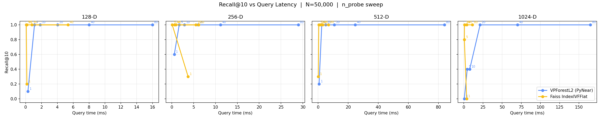
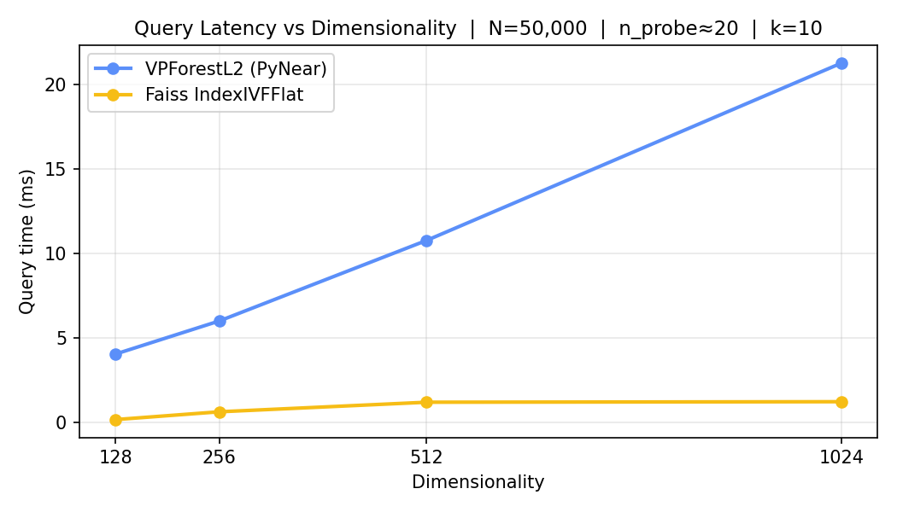
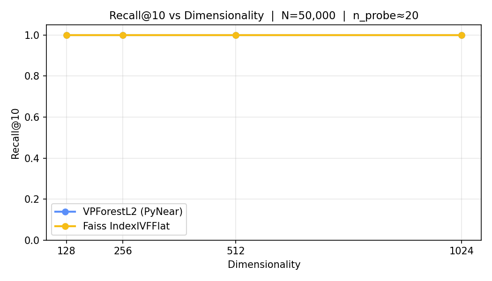
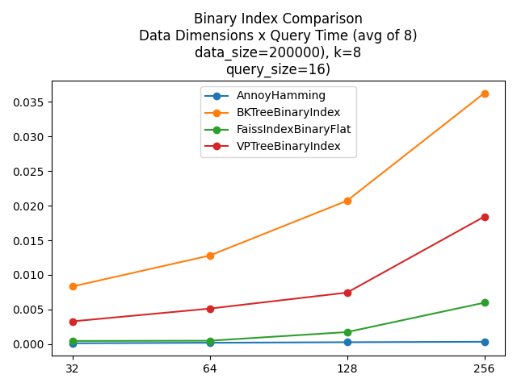
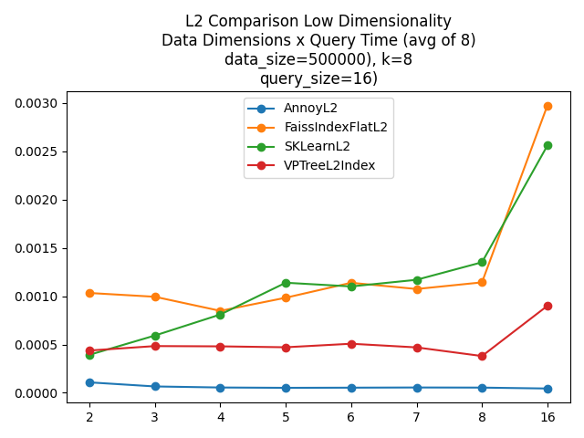
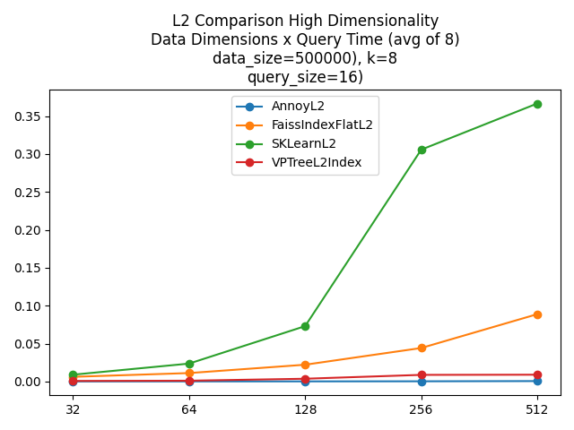
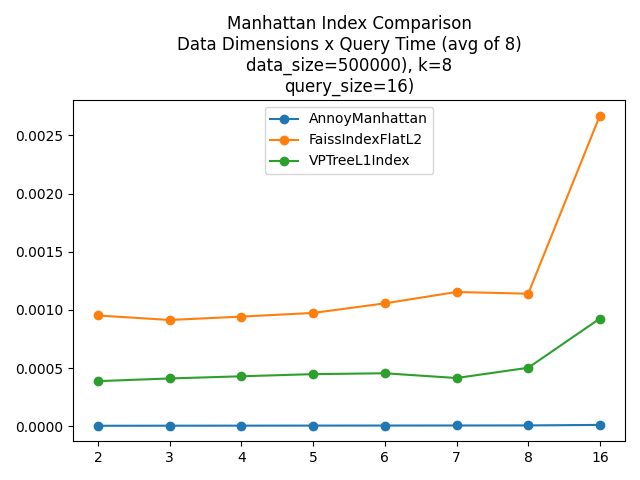
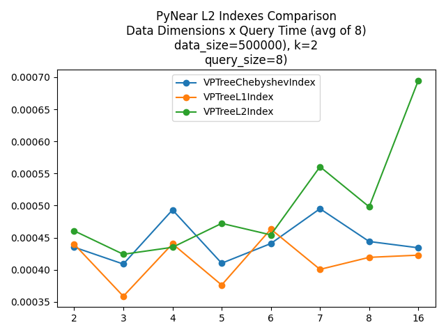
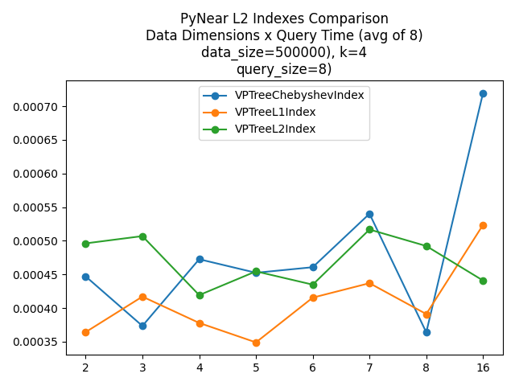
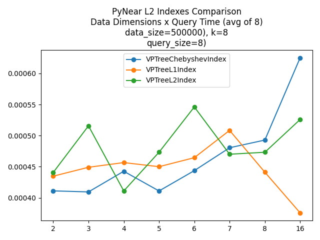

# Comparison Benchmarks

Several benchmarks were generated to compare performance between PyNear and other python libraries.
All benchmarks were generated using Intel(R) Core(TM) Ultra 9 285K, 24 cores.

In the below benchmarks, other libraries such as Annoy, Faiss and SKLearn are used. Annoy is inexact search (approximate) so it is somehow unfair comparison, but being extremelly efficient is an interesting baseline.

---

# Approximate L2 Search — High Dimensionality (IVFFlatL2Index vs Faiss IVF)

These benchmarks compare PyNear's **IVFFlatL2Index** against **Faiss IndexIVFFlat** — both
IVF-style approximate indices — across 128-D to 1024-D with 50 000 data points.
`n_probe` is swept from 1 to 80 (out of ~224 clusters) to show the recall vs speed Pareto curve.
`FaissIndexFlatL2` (exact brute-force) is included as a reference baseline.

## Recall@10 vs Query Latency

Each point on the curve is one `n_probe` setting; the annotation shows its value.
Move right along a curve to gain recall at the cost of latency.



**Key observations:**
- At **128-D – 512-D** both indices reach 100% recall at `n_probe=5`, with Faiss IVF having lower raw latency due to its BLAS-optimised inner-cluster scan.
- At **1024-D** FaissIVF reaches 100% recall at `n_probe=10` (~1 ms); IVFFlatL2Index needs `n_probe=20` (~10.6 ms) with the BLAS-backed flat scan.

## Query Latency vs Dimensionality (n_probe ≈ 20)



## Recall@10 vs Dimensionality (n_probe ≈ 20)



**Summary table** — `n_probe=20`, `N=50 000`, `k=10`, `nq=32`:

| Dim | IVFFlatL2 time | FaissIVF time | IVFFlatL2 recall | FaissIVF recall |
|-----|---------------|--------------|-----------------|----------------|
| 128 | 4.0 ms | 0.2 ms | 1.00 | 1.00 |
| 256 | 6.0 ms | 0.6 ms | 1.00 | 1.00 |
| 512 | 10.8 ms | 1.2 ms | 1.00 | 1.00 |
| 1024 | 21.2 ms | 1.2 ms | 1.00 | 1.00 |

> **When to prefer IVFFlatL2Index over Faiss IVF:** pure-Python install (NumPy only, no
> native Faiss build), need exact search via `n_probe=n_clusters`, or working in environments
> where Faiss is unavailable.

---

# Binary Index Comparison

For binary indices, only 32, 64, 128 and 256 bit dimensions were added since they are the most popular dimension for binary descriptors.



# L2 Index - Low Dimensionality Comparison


# L2 Index - High Dimensionality Comparison


# L1 Index Comparison


# PyNear Index Comparison K=2


# PyNear Index Comparison K=4


# PyNear Index Comparison K=8


# How to Create and Run Benchmarks

The benchmark tool (pynear/benchmark/run_benchmarks.py) read `yaml` configuration files where benchmark cases can be personalized, like below example:
```yaml
benchmark:
  cases:
  - name: "PyNear L2 Indexes Comparison"
    k: [2, 4, 8]
    num_queries: [8]
    dimensions: [2, 3, 4, 5, 6, 7, 8, 16]
    dataset_total_size: 2500000
    dataset_num_clusters: 50
    dataset_type: "float32" # can be any numpy type as string. Default is float32
    index_types:
    - VPTreeL2Index
    - VPTreeChebyshevIndex
    - VPTreeL1Index # (manhattan distance)
  - name: "L2 Comparison Low Dimensionality"
    k: [8]
    num_queries: [16]
    dimensions: [2, 3, 4, 5, 6, 7, 8, 16]
    dataset_total_size: 2500000
    dataset_num_clusters: 50
    dataset_type: "float32"
    index_types:
    - FaissIndexFlatL2
    - VPTreeL2Index
    - AnnoyL2
    - SKLearnL2
  - name: "Binary Index Comparison"
    k: [8]
    num_queries: [16]
    dimensions: [32, 64, 128, 256, 512]
    dataset_total_size: 2500000
    dataset_num_clusters: 50
    dataset_type: "uint8"
    index_types:
    - FaissIndexBinaryFlat
    - AnnoyHamming
    - VPTreeBinaryIndex

```

Supported index names:

**Exact:**
- `VPTreeL2Index`, `VPTreeL1Index`, `VPTreeBinaryIndex`, `VPTreeChebyshevIndex`
- `BKTreeBinaryIndex`
- `FaissIndexFlatL2`, `FaissIndexBinaryFlat`
- `AnnoyL2`, `AnnoyManhattan`, `AnnoyHamming`
- `SKLearnL2`

**Approximate (IVF-style):**
- `IVFFlatL2Index` — PyNear IVF with BLAS flat scan; add `_nprobeN` suffix to set n_probe (e.g. `IVFFlatL2Index_nprobe20`)
- `FaissIVFL2` — Faiss IndexIVFFlat baseline; add `_nprobeN` suffix (e.g. `FaissIVFL2_nprobe20`)

This allows comparing any combination of exact and approximate indices.

Output results are generated in `results` folder grouped in subfolders with benchmark cases name.
For generating benchmarks from `yaml` descriptor, see the example command below:


## How to run
```
export PYTHONPATH=$PWD
python3 pynear/benchmark/run_benchmarks.py --config-file=<config-yaml-file>
```

This will write result images to a local ./results folder.

