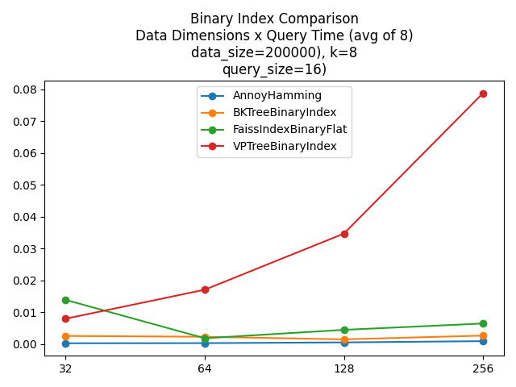

# Comparison Benchmarks

Several benchmarks were generated to compare performance between PyNear and other python libraries.
All benchmarks were generated using 12th Gen Intel(R) Core(TM) i9-12900, 24 cores.

In the below benchmarks, other libraries such as Annoy, Faiss and SKLearn are used. Annoy is inexact search (approximate) so it is somehow unfair comparison, but being extremelly efficient is an interesting baseline.

# Binary Index Comparison

For binary indices, only 32, 64, 128 and 256 bit dimensions were added since they are the most popular dimension for binary descriptors.



# L2 Index - Low Dimensionality Comparison


# L2 Index - High Dimensionality Comparison


# L1 Index Comparison


# PyNear Index Comparison K=2


# PyNear Index Comparison K=4


# PyNear Index Comparison K=8


# How to Create and Run Benchmarks

The benchmark tool (pynear/benchmark/run_benchmarks.py) read `yaml` configuration files where benchmark cases can be personalized, like below example:
```yaml
benchmark:
  cases:
  - name: "PyNear L2 Indexes Comparison"
    k: [2, 4, 8]
    num_queries: [8]
    dimensions: [2, 3, 4, 5, 6, 7, 8, 16]
    dataset_total_size: 2500000
    dataset_num_clusters: 50
    dataset_type: "float32" # can be any numpy type as string. Default is float32
    index_types:
    - VPTreeL2Index
    - VPTreeChebyshevIndex
    - VPTreeL1Index # (manhattan distance)
  - name: "L2 Comparison Low Dimensionality"
    k: [8]
    num_queries: [16]
    dimensions: [2, 3, 4, 5, 6, 7, 8, 16]
    dataset_total_size: 2500000
    dataset_num_clusters: 50
    dataset_type: "float32"
    index_types:
    - FaissIndexFlatL2
    - VPTreeL2Index
    - AnnoyL2
    - SKLearnL2
  - name: "Binary Index Comparison"
    k: [8]
    num_queries: [16]
    dimensions: [32, 64, 128, 256, 512]
    dataset_total_size: 2500000
    dataset_num_clusters: 50
    dataset_type: "uint8"
    index_types:
    - FaissIndexBinaryFlat
    - AnnoyHamming
    - VPTreeBinaryIndex

```

Supported 3rd party indices are:
- FaissIndexFlatL2
- FaissIndexBinaryFlat
- AnnoyL2
- AnnoyManhattan
- AnnoyHamming
- SKLearnL2

 This allow comparing VPTree indices to be tested with third party indices as well any combination of indices.

Output results are generated in `results` folder grouped in subfolders with benchmark cases name.
For generating benchmarks from `yaml` descriptor, see the example command below:


## How to run
```
export PYTHONPATH=$PWD
python3 pynear/benchmark/run_benchmarks.py --config-file=<config-yaml-file>
```

This will write result images to a local ./results folder.

