# Comparison Benchmarks

How to generate standard benchmarks:

In the pyvptree root, type:

```
make benchmarks
```

To customize the benchmark generation dimension range, see the example below:

```
export PYTHONPATH=$PWD
python3 pyvptree/benchmark/run_benchmarks.py --min-dimension=3 --max-dimension=8
```

This will write result images to a local ./results folder.


## Benchmarks for fixed K = 16

All benchmarks were generated using 12th Gen Intel(R) Core(TM) i7-1270P with 16 cores.

Benchmarks for K=16 are displayed below:

### 2 to 10 dimensions Range

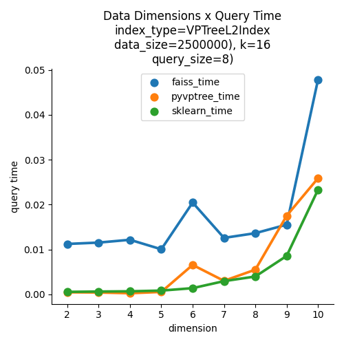

### 11 to 16 dimensions Range

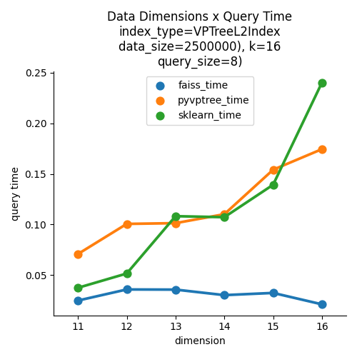

### 17 to 32 dimensions Range
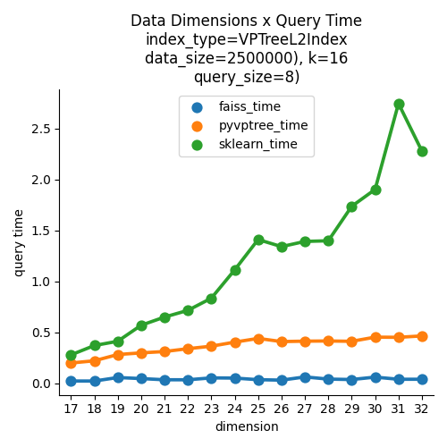

### 33 to 48 dimensions Range

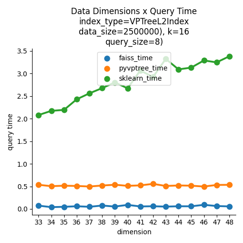

### Benchmarks for other values of K

The graphs below include K values of 1, 2, 4, 8 and 16:

### 2 to 10 dimensions Range, for K=1, 2, 4, 8, 16


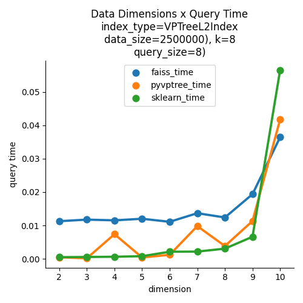
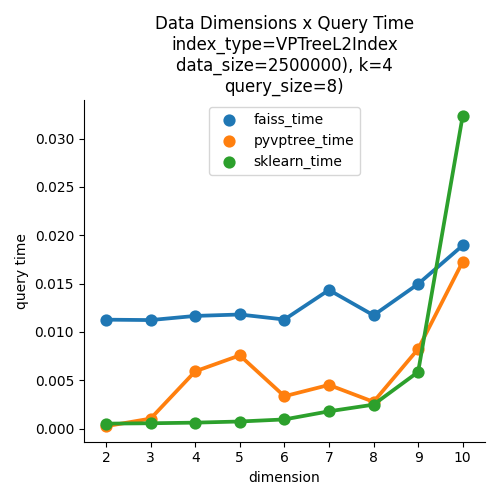
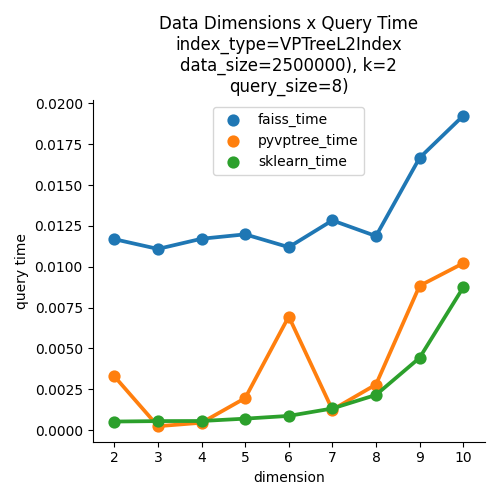
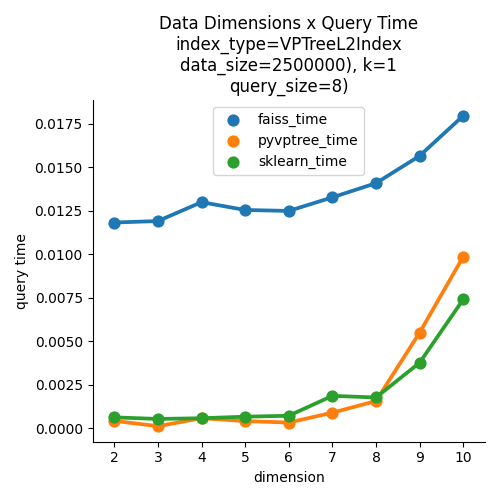

### 11 to 16 dimensions Range, for K=1, 2, 4, 8, 16


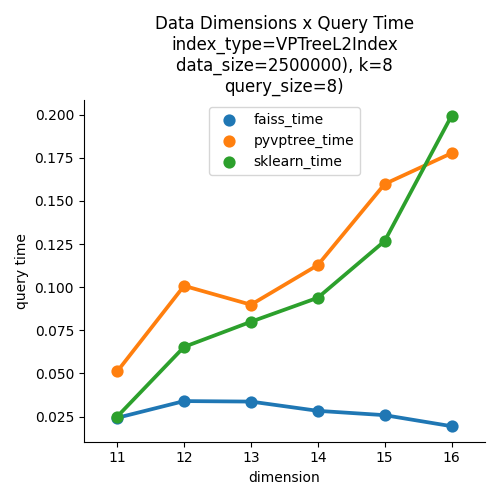
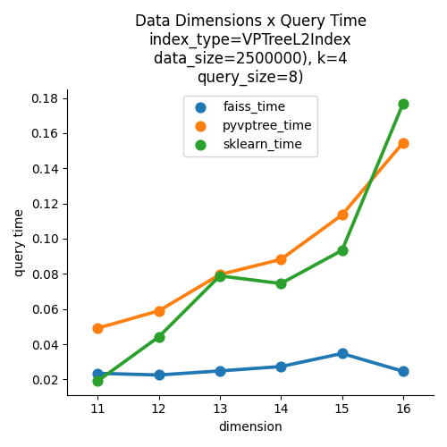
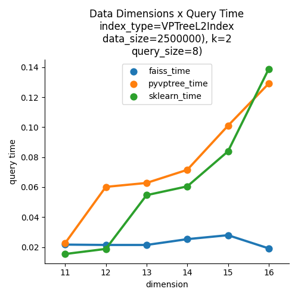
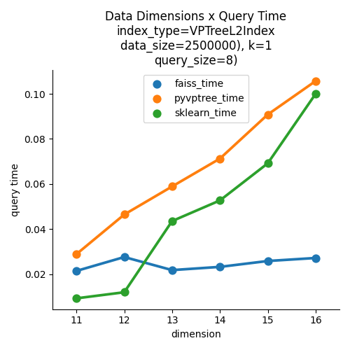

### 17 to 32 dimensions Range, for K=1, 2, 4, 8, 16


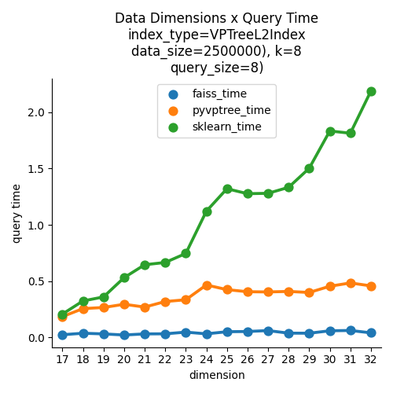
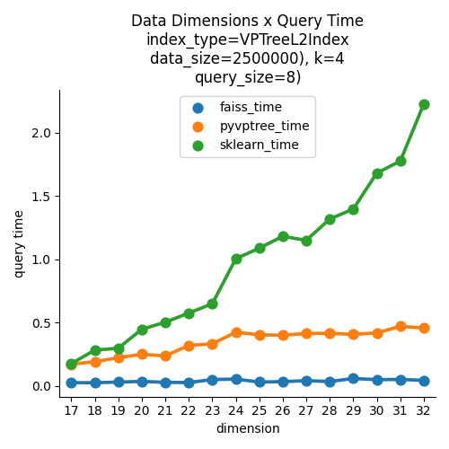
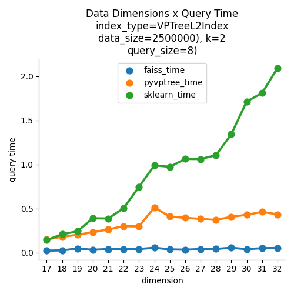
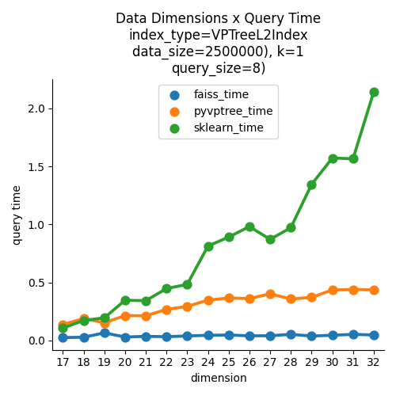

### 33 to 48 dimensions Range, for K=1, 2, 4, 8, 16


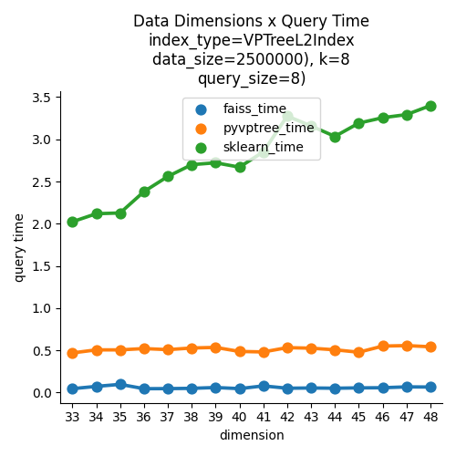
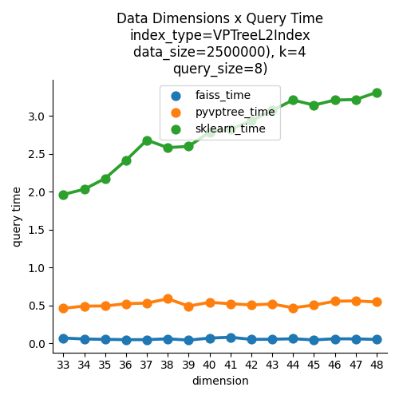
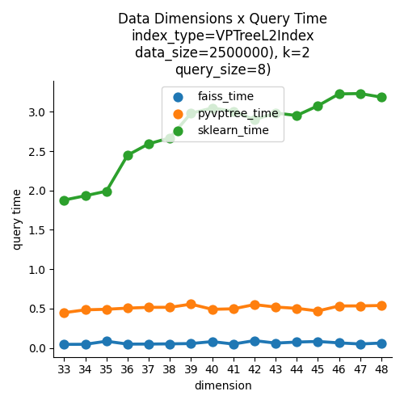
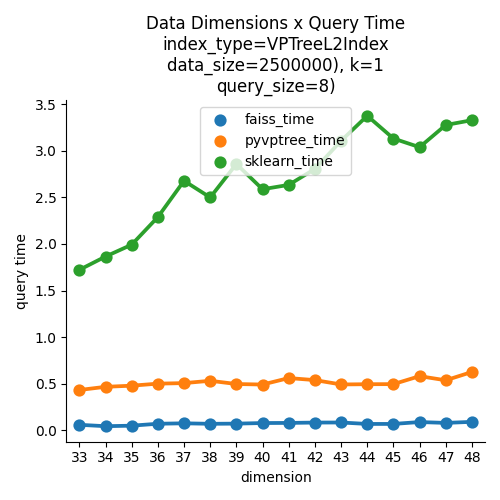
